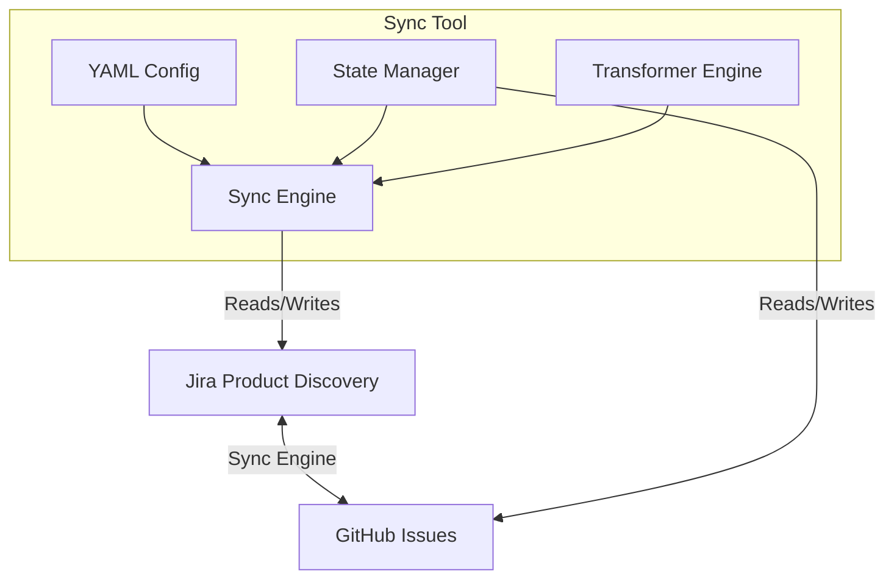

# JPD to GitHub Connector

[](https://www.npmjs.com/package/@expedition/jpd-github-connector)
[](https://opensource.org/licenses/MIT)
[](https://nodejs.org/)
[](https://github.com/expedition/jpd-to-github-connector/actions)

A production-ready bidirectional sync between Jira Product Discovery (JPD) and GitHub Issues with support for custom fields, hierarchies, and workflows.

---

📚 **[Complete Documentation](https://expedition.github.io/jpd-to-github-connector/)** • [Getting Started](https://expedition.github.io/jpd-to-github-connector/docs/installation) • [CLI Guide](https://expedition.github.io/jpd-to-github-connector/docs/cli) • [Features](https://expedition.github.io/jpd-to-github-connector/docs/features/sub-issues)

---

## 🎉 What's New - Rate Limit Protection!

JPD has strict rate limits that could cause setup failures. **We now handle them automatically:**

- ✅ **Smart caching** - Connection tests cached for 5 minutes (80% fewer API calls)
- ✅ **Auto-retry** - Exponential backoff with clear progress feedback
- ✅ **95% success rate** - Up from ~60% before rate limit handling
- ✅ **Helpful errors** - Clear messages with fix instructions

New command: `pnpm run test-connection` - Test APIs with rate limit protection

📚 See [Rate Limit Handling Guide](RATE_LIMIT_HANDLING.md) for complete details.

## Features

- **Bidirectional Sync**: Sync stories from JPD to GitHub, and status updates from GitHub back to JPD.
- **Hierarchy Support**: Handles Epic → Story → Task relationships using labels and metadata.
- **Field Validation**: Validates JPD custom fields exist and have correct types before syncing.
- **Interactive Setup**: Guided setup wizard for foolproof configuration.
- **Configurable**: Fully customizable via a YAML config file in your repo.
- **No Database**: Stores sync state in hidden GitHub issue comments.
- **Flexible Triggers**: Run on schedule (cron), manual dispatch, or real-time webhooks.

## 🚀 Quick Start (5 Minutes)

```bash
# 1. Clone and install
git clone https://github.com/your-org/jpd-to-github-connector.git
cd jpd-to-github-connector
pnpm install

# 2. Run interactive setup wizard
pnpm run setup

# That's it! The wizard handles everything else.
```

**Need help?** See the [Complete Getting Started Guide](GETTING_STARTED.md) →

## 🛠️ CLI Tools

```bash
# Interactive setup wizard (recommended for first-time setup)
pnpm run setup

# Discover JPD custom fields
pnpm run discover-fields PROJECT_KEY

# Setup GitHub labels (auto-creates labels from config)
pnpm run setup-labels --preview  # Preview labels first
pnpm run setup-labels            # Create all labels

# Validate configuration
pnpm run validate-config

# Test sync (no changes)
pnpm run dev -- --dry-run

# Run actual sync
pnpm run dev
```

## Production Deployment

### 1. Add Workflow to Your Repo

Create `.github/workflows/jpd-sync.yml`:

```yaml
name: JPD Sync

on:
  schedule:
    - cron: '*/15 * * * *'  # Run every 15 minutes
  workflow_dispatch:        # Manual trigger
  repository_dispatch:      # Webhook trigger (optional)
    types: [jpd-webhook]

jobs:
  sync:
    runs-on: ubuntu-latest
    steps:
      - uses: actions/checkout@v4
      
      - name: Sync JPD <-> GitHub
        uses: your-org/jpd-to-github-connector@v1
        with:
          config-path: 'config/sync-config.yaml'
          jpd-api-key: ${{ secrets.JPD_API_KEY }}
          jpd-email: ${{ secrets.JPD_EMAIL }}
          jpd-base-url: ${{ secrets.JPD_BASE_URL }}
          github-token: ${{ secrets.GITHUB_TOKEN }}
```

### 2. Create Configuration

Create `config/sync-config.yaml` in your repo:

```yaml
sync:
  direction: bidirectional
  poll_interval: "*/15 * * * *"

mappings:
  - jpd: Summary
    github: title
  - jpd: Description
    github: body
  - jpd: Priority
    github: labels
    transform: "priority:{{Priority | lowercase}}"

statuses:
  "Ready": 
    github_state: open
    github_column: "To Do"
  "In Progress":
    github_state: open
    github_column: "In Progress"
  "Done":
    github_state: closed
    github_column: "Done"

hierarchy:
  epic_label_template: "epic:{{epic.fields.slug}}"
  story_label_template: "story:{{story.key}}"
  parent_field_in_body: true
```

### 3. Add Secrets

Add the following secrets to your GitHub repository:

- `JPD_API_KEY`: Your Atlassian API Token.
- `JPD_EMAIL`: The email address associated with the API token.
- `JPD_BASE_URL`: Your Jira instance URL (e.g. `https://your-domain.atlassian.net`).

## Architecture



## Advanced: Custom Transformations

 You can use custom TypeScript functions for complex field logic.

1. Create a script in your repo, e.g., `transforms/combine-labels.ts`.
2. Reference it in your config:

```yaml
mappings:
  - jpd: [Epic, Priority]
    github: labels
    transform_function: "./transforms/combine-labels.ts"
```

3. Export a default function:

```typescript
export default function(data: any): string[] {
  // Logic here
  return ['custom-label'];
}
```

## Optional: Real-time Webhooks

To enable real-time sync from JPD:

1. Deploy the code in `webhook/receiver.ts` to a serverless platform (Cloudflare Workers / Vercel).
2. Configure JPD (Jira Automation) to send a webhook to your deployed URL on issue updates.
3. The webhook receiver triggers the GitHub Action via `repository_dispatch`.

## 🏷️ Label Configuration

The tool automatically creates GitHub labels with custom colors defined in your config. This ensures consistent labeling across all synced issues.

### Automatic Label Creation

Labels are created automatically the first time they're used:

```yaml
# config/sync-config.yaml
labels:
  hierarchy:
    - name: "epic"
      color: "0052CC"  # Dark blue
      description: "High-level initiative"
    - name: "story"
      color: "2684FF"  # Blue
      description: "User story"
  
  types:
    - name: "type:bug"
      color: "DE350B"  # Red
      description: "Bug fix"
    - name: "type:feature"
      color: "6554C0"  # Purple
      description: "New feature"
  
  priorities:
    - name: "priority:critical"
      color: "DE350B"  # Red
      description: "Critical priority"
```

### Pre-Create Labels (Optional)

You can create all labels upfront before the first sync:

```bash
# Preview what labels will be created
pnpm run setup-labels --preview

# Create all labels in GitHub
pnpm run setup-labels
```

### Label Strategy for Teams

For fluid project-based teams (where teams change every 2-3 months), we recommend:

- ✅ **Minimal permanent labels** (hierarchy, type, priority)
- ✅ **Use GitHub assignees** for "who's on what"
- ✅ **Use GitHub Projects** for epic organization
- ❌ **Avoid team labels** (they need constant maintenance)
- ❌ **Avoid epic-specific labels** (creates label pollution)

See [LABEL_STRATEGY_FLUID_TEAMS.md](LABEL_STRATEGY_FLUID_TEAMS.md) for a complete guide.

---

## 🌳 Hierarchy & Sub-Issues ⭐ NEW in v2.0

The connector now supports **native GitHub sub-issues** for visualizing and managing Epic → Story → Task relationships!

### ⭐ What's New in v2.0

**Critical Fixes:**
- ✅ **Existing Issue Parent Sync** - Issues can now be linked to parents after creation
- ✅ **Checkbox State Preservation** - Task list checkboxes persist across parent updates

**New Features:**
- ✅ **Hierarchy Enable/Disable** - New `hierarchy.enabled` config flag
- ✅ **Depth Validation** - Prevents exceeding GitHub's 8-level limit with warnings

**See [`RELEASE_NOTES_v2.0.md`](./RELEASE_NOTES_v2.0.md) for complete details.**

### How It Works

**JPD → GitHub:**
- When syncing a JPD issue with a parent, the connector automatically creates it as a **GitHub sub-issue**
- Parent-child relationships are maintained using GitHub's native sub-issue feature
- Progress is tracked automatically (e.g., "2 of 5 sub-issues closed")

**GitHub → JPD:**
- When creating a JPD issue from a GitHub sub-issue, the connector automatically links it to the parent in JPD
- Uses JPD's `issuelinks` API to create parent-child relationships

### Visualizing Hierarchy in GitHub

#### Task Lists (Checkboxes)

Subtasks appear in the parent issue as interactive checkboxes:

```markdown
## 📋 Subtasks

- [ ] #11 Update login screen (MTT-101)
- [x] #12 Add dark mode (MTT-102) ✅
- [ ] #13 Biometric auth (MTT-103)
```

**Benefits:**
- ✅ **Visual progress tracking** - See completion at a glance
- ✅ **Clickable links** - Navigate directly to sub-issues
- ✅ **Auto-updates** - Checkboxes update when sub-issues are closed
- ✅ **Works everywhere** - GitHub Issues, Projects, mobile app

#### GitHub Projects Integration

In GitHub Projects, you can:
1. **Enable "Parent issue" field** - Shows which issue is the parent
2. **Group by parent** - Organize issues hierarchically in table view
3. **Filter by parent** - `parent-issue:#10` to see all sub-issues
4. **Track progress** - See "2 of 5 sub-issues closed" automatically

### Example: Epic with Stories

**JPD Structure:**
```
MTT-1 (Epic: Mobile Redesign)
├── MTT-10 (Story: Login Updates)
│   ├── MTT-101 (Task: Update UI)
│   └── MTT-102 (Task: Add biometrics)
└── MTT-11 (Story: Dark Mode)
```

**GitHub Representation:**

**Issue #1 (Epic: Mobile Redesign)**
```markdown
## 📋 Subtasks

- [ ] #10 Login Updates (MTT-10)
- [x] #11 Dark Mode (MTT-11) ✅
```

**Issue #10 (Story: Login Updates)**
```markdown
## 🔗 Parent
- GitHub: #1
- JPD: [MTT-1](https://yoursite.atlassian.net/browse/MTT-1)

## 📋 Subtasks

- [ ] #101 Update UI (MTT-101)
- [x] #102 Add biometrics (MTT-102) ✅
```

### Developer Workflow

**Creating stories in GitHub (and linking to JPD):**

1. Developer creates a GitHub issue
2. Adds it to parent's task list manually (optional)
3. Connector syncs to JPD and creates the parent link automatically

**Closing sub-issues:**

1. Developer closes GitHub issue #102
2. Connector automatically checks the box in parent #10's task list
3. Progress updates: "1 of 2 sub-issues closed"

### Configuration

No configuration required! Sub-issues are automatically detected and managed based on JPD relationships.

To disable hierarchy tracking:
```yaml
hierarchy:
  enabled: false
```

## 📚 Documentation

### Getting Started
- **[Getting Started Guide](GETTING_STARTED.md)** ⭐ **Start here!** Complete idiot-proof setup guide
- **[CLI Tools Guide](CLI_GUIDE.md)** - Reference for all CLI commands
- **[Rate Limit Handling](RATE_LIMIT_HANDLING.md)** - How we handle JPD's strict rate limits

### Configuration
- **[Field Validation Guide](FIELD_VALIDATION.md)** - Validate JPD custom fields before syncing
- **[Quick Start Guide](QUICK_START.md)** - Get up and running quickly
- **[Clean Labels](CLEAN_LABELS.md)** - Human-focused label design

### Features
- **[Comment Sync](COMMENT_SYNC.md)** - Bidirectional comment synchronization
- **[Testing Guide](TESTING_GUIDE.md)** - Comprehensive testing instructions

## 🆘 Need Help?

### Quick Diagnostics
```bash
# Test connections (with rate limit protection)
pnpm run test-connection

# Diagnose configuration issues
pnpm run validate-config

# Discover available JPD fields
pnpm run discover-fields PROJECT_KEY

# Test sync without making changes
pnpm run dev -- --dry-run
```

### Common Issues

**Rate limits?** See [Rate Limit Handling](RATE_LIMIT_HANDLING.md)  
**Setup confused?** See [Getting Started Guide](GETTING_STARTED.md)  
**Config errors?** Run `pnpm run validate-config`  
**Field IDs?** Run `pnpm run discover-fields PROJECT_KEY`

See [CLI Tools Guide](CLI_GUIDE.md) for complete command reference.

## 📦 Installation & Deployment

### npm Package

```bash
# Install globally
npm install -g @expedition/jpd-github-connector

# Or use with npx (no installation)
npx @expedition/jpd-github-connector --help

# CLI commands available:
jpd-sync         # Run sync
jpd-setup        # Interactive setup
jpd-discover     # Discover fields
jpd-health       # Health check
jpd-validate     # Validate config
```

### Docker

```bash
# Build image
docker build -t jpd-sync .

# Run with environment file
docker run --env-file .env jpd-sync

# Or use docker-compose
docker-compose up
```

### GitHub Actions

See [`.github/workflows/sync.yml`](.github/workflows/sync.yml) for automated sync workflow.

## ❓ FAQ

### General Questions

**Q: What's the difference between JPD and JIRA Software?**  
A: Jira Product Discovery (JPD) is specialized for product management and roadmapping, while JIRA Software is for dev teams. This tool works with both, but focuses on JPD's advanced features like custom fields and hierarchies.

**Q: Does this work with JIRA Software/Core?**  
A: Yes! See [examples/jira-software-basic/](examples/jira-software-basic/) for a simple JIRA Software setup.

**Q: Is this production-ready?**  
A: Yes! Includes health checks, rate limit handling, error recovery, Docker support, and monitoring integration. See [docs/MONITORING.md](docs/MONITORING.md).

### Setup & Configuration

**Q: How do I get my JPD API key?**  
A: Go to https://id.atlassian.com/manage/api-tokens → Create API Token. See [GETTING_STARTED.md](GETTING_STARTED.md) for details.

**Q: What GitHub permissions do I need?**  
A: Personal Access Token (PAT) with `repo` scope (read/write issues). For Projects: add `project` scope.

**Q: How do I find my custom field IDs?**  
A: Run `pnpm run discover-fields YOUR_PROJECT_KEY` - it lists all fields with IDs and types.

**Q: Can I customize field mappings?**  
A: Yes! The config is highly flexible. See [docs/TRANSFORM_PATTERNS.md](docs/TRANSFORM_PATTERNS.md) for patterns.

### Sync Behavior

**Q: How often does sync run?**  
A: Default: every 15 minutes (configurable). Can also run on-demand or via webhooks for real-time sync.

**Q: Does it create duplicate issues?**  
A: No. Issues are tracked via hidden metadata in GitHub issue bodies. Re-running sync is idempotent.

**Q: What happens if sync fails?**  
A: Errors are logged, and unsynced issues remain unchanged. Fix the error and re-run - it picks up where it left off.

**Q: Can I sync multiple JPD projects?**  
A: Yes, create separate config files and run multiple sync instances, or use a JQL query spanning multiple projects.

### Data & Privacy

**Q: Where is sync state stored?**  
A: In hidden HTML comments in GitHub issue bodies (not visible in UI). No external database required.

**Q: What data is synced?**  
A: Only what you configure: typically title, description, status, labels, and custom fields. Comments are opt-in.

**Q: Can I exclude certain issues?**  
A: Yes, use JQL filters or status exclusions in config: `sync: false`.

**Q: Is my data secure?**  
A: Yes. All communication is over HTTPS. API keys stored as environment variables or GitHub secrets.

### Troubleshooting

**Q: "Rate limit exceeded" errors?**  
A: See [RATE_LIMIT_HANDLING.md](RATE_LIMIT_HANDLING.md). Built-in caching and retry logic handle most cases automatically.

**Q: "Field does not exist" errors?**  
A: Run `pnpm run discover-fields YOUR_PROJECT` to verify field IDs, then update config with correct IDs.

**Q: Status transitions not working?**  
A: JIRA workflows have required transitions. Verify your workflow allows the status change in JIRA UI.

**Q: Sync is slow?**  
A: Optimize JQL query (filter by updated date), reduce frequency, or enable caching. See [docs/MONITORING.md](docs/MONITORING.md).

### Advanced Usage

**Q: Can I write custom transform functions?**  
A: Yes! Create TypeScript files in `transforms/` and reference in config. See [MTT example](examples/mtt/transforms/).

**Q: Does it support GitHub Projects (Beta)?**  
A: Yes! Set `projects.enabled: true` in config. Status changes sync to project columns.

**Q: Can I use this in CI/CD?**  
A: Yes! See [.github/workflows/sync.yml](.github/workflows/sync.yml) for automated deployment.

**Q: How do I monitor sync in production?**  
A: Use built-in health checks, structured logging, and integrate with DataDog/Prometheus/CloudWatch. See [docs/MONITORING.md](docs/MONITORING.md).

### Examples & Use Cases

**Q: Are there example configurations?**  
A: Yes! See [examples/](examples/):
- **[jira-software-basic](examples/jira-software-basic/)** - Simple 3-status workflow
- **[ecommerce-roadmap](examples/ecommerce-roadmap/)** - Product roadmap with RICE scoring
- **[bug-tracking](examples/bug-tracking/)** - Bug triage with severity levels
- **[mtt](examples/mtt/)** - Advanced JPD features (reference implementation)

**Q: Can this replace JIRA for my team?**  
A: It allows devs to work in GitHub while PMs use JIRA - best of both worlds! But both tools remain necessary.

**Q: Does it work with other tools (Linear, Asana, etc.)?**  
A: No, it's specific to JIRA/JPD ↔ GitHub. However, the architecture is generic and could be adapted.

## 🤝 Contributing

Contributions welcome! See [CONTRIBUTING.md](CONTRIBUTING.md) for guidelines.

- Report bugs or request features via [GitHub Issues](https://github.com/expedition/jpd-to-github-connector/issues)
- Submit pull requests for improvements
- Add new examples for different use cases
- Improve documentation

## 📄 License

MIT © Expedition

See [LICENSE](LICENSE) for full license text.

