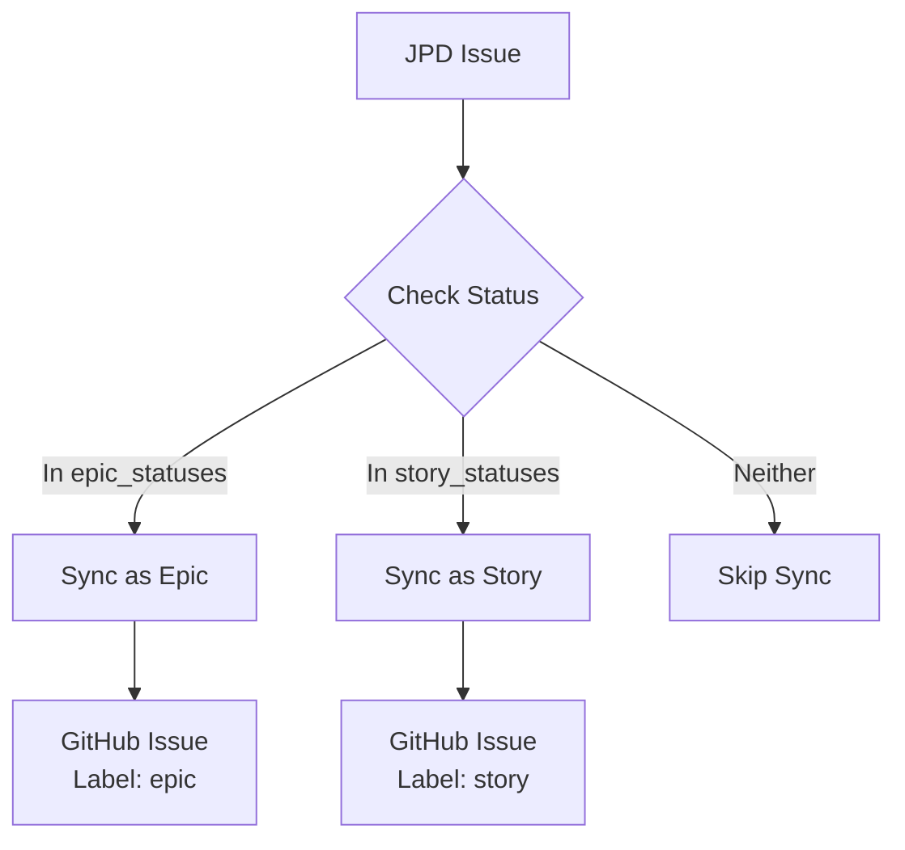
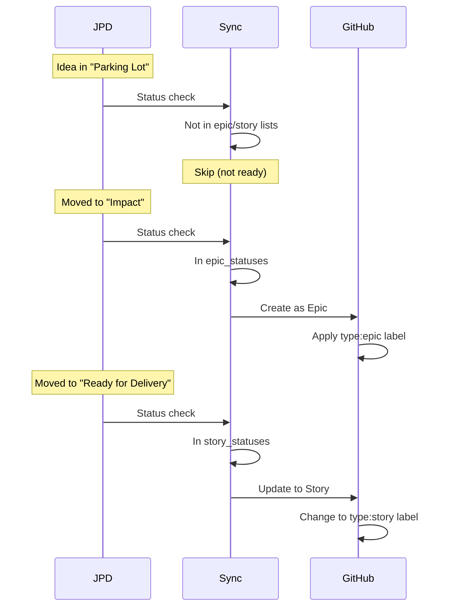

# Hierarchy Configuration

Hierarchy configuration enables Epic > Story > Task relationships, allowing you to organize work into logical levels that reflect your planning structure.

## How Hierarchy Works

The connector uses JPD statuses to determine issue hierarchy levels:



**Key concept:** Issues only sync when their status matches configured hierarchy levels.

## Basic Hierarchy Configuration

Enable hierarchy in the `hierarchy` section:

```yaml
hierarchy:
  enabled: true  # Enable hierarchy features
  use_github_sub_issues: true  # Use native GitHub sub-issues
  
  epic_statuses:
    - "Impact"  # Issues in this status become Epics
    
  story_statuses:
    - "Ready for Delivery"  # Issues in these statuses become Stories
    - "Delivery"
    - "Done"
```

### Hierarchy Properties

**enabled**
- Type: Boolean
- Default: `true`
- Enables hierarchy-based sync

**use_github_sub_issues**
- Type: Boolean
- Default: `true`
- Uses GitHub's native parent-child issue relationships
- Requires appropriate GitHub API permissions

**epic_statuses**
- Type: Array of strings
- Statuses that indicate Epic level
- Issues in these statuses get `epic` label

**story_statuses**
- Type: Array of strings
- Statuses that indicate Story level
- Issues in these statuses get `story` label

## Status-Based Filtering

Only issues in `epic_statuses` or `story_statuses` are synced:

```yaml
hierarchy:
  enabled: true
  epic_statuses:
    - "Impact"
  story_statuses:
    - "Ready for Delivery"

# These JPD statuses exist but don't trigger sync:
# - "Parking Lot" (ideas, not ready)
# - "Discovery" (being researched)
```

**Workflow:**
1. Issue created in JPD with status "Parking Lot"
2. Sync runs → Issue skipped (not in epic/story statuses)
3. Status moved to "Impact"
4. Sync runs → Issue created in GitHub as Epic
5. Status moved to "Ready for Delivery"
6. Sync runs → Issue updated, relabeled as Story

## Hierarchy Labels

Issues automatically receive hierarchy labels:

### Type Labels

Based on status list membership:

```yaml
hierarchy:
  epic_statuses: ["Impact"]
  story_statuses: ["Ready for Delivery", "Delivery"]
```

**Labels applied:**
- Status "Impact" → `type:epic`
- Status "Ready for Delivery" → `type:story`
- Status "Delivery" → `type:story`

### Hierarchy Reference Labels

Issues also receive reference labels for parent relationships:

**Epic MTT-11:**
- Labels: `type:epic`, `epic:MTT-11`

**Story MTT-12 (child of MTT-11):**
- Labels: `type:story`, `story:MTT-12`, `epic:MTT-11`

**Task (child of MTT-12):**
- Labels: `type:task`, `story:MTT-12`, `epic:MTT-11`

These labels enable filtering by hierarchy:
```
is:issue label:epic:MTT-11  # All issues under this Epic
```

## Parent-Child Relationships

### Native GitHub Sub-Issues

When `use_github_sub_issues: true`:

```yaml
hierarchy:
  use_github_sub_issues: true
```

**Features:**
- Uses GitHub's built-in parent-child relationships
- Parent issues show child count
- Child issues link to parent
- Progress tracking in parent issue

**Requirements:**
- GitHub organization or personal account with sub-issues feature
- Token with `repo` scope

### Body-Based References

When `use_github_sub_issues: false`:

```yaml
hierarchy:
  use_github_sub_issues: false
  parent_field_in_body: true  # Add parent references to issue body
```

**Result in issue body:**
```markdown
**Parent Epic:** #45 (MTT-11)

---
Issue description here...
```

## Complete Hierarchy Example

### Product Discovery Workflow

```yaml
hierarchy:
  enabled: true
  use_github_sub_issues: true
  
  # Epics: High-level initiatives (2-3 months)
  epic_statuses:
    - "Impact"  # Validated, ready to break down
    
  # Stories: Deliverable units (1-2 weeks)
  story_statuses:
    - "Ready for Delivery"  # Ready to implement
    - "Delivery"            # In development
    - "Done"                # Completed

# Issues NOT synced (filtered out):
# - "Parking Lot" - Raw ideas
# - "Discovery" - Being researched

statuses:
  "Parking Lot":
    github_state: "open"
  "Discovery":
    github_state: "open"
  "Impact":
    github_state: "open"
  "Ready for Delivery":
    github_state: "open"
  "Delivery":
    github_state: "open"
  "Done":
    github_state: "closed"

labels:
  hierarchy:
    - name: "epic"
      color: "6554C0"
      description: "High-level initiative (2-3 month project)"
    - name: "story"
      color: "0052CC"
      description: "Deliverable unit of work (1-2 week effort)"
    - name: "task"
      color: "4C9AFF"
      description: "Implementation task (1-3 day effort)"
```

### Traditional Scrum

```yaml
hierarchy:
  enabled: true
  use_github_sub_issues: true
  
  epic_statuses:
    - "Epic"
    
  story_statuses:
    - "Story"
    - "In Progress"
    - "Done"

statuses:
  "Epic":
    github_state: "open"
  "Story":
    github_state: "open"
  "In Progress":
    github_state: "open"
  "Done":
    github_state: "closed"
```

## Hierarchy in Action

### Creating an Epic

1. Create issue in JPD: "Mobile App Redesign"
2. Set status to "Impact" (epic_statuses)
3. Run sync: `pnpm run dev`
4. GitHub issue created with:
   - Label: `type:epic`
   - Label: `epic:MTT-11`
   - Title: `[MTT-11] Mobile App Redesign`

### Creating Stories Under Epic

1. Create child issues in JPD
2. Set parent to MTT-11 in JPD
3. Set status to "Ready for Delivery" (story_statuses)
4. Run sync
5. GitHub issues created with:
   - Label: `type:story`
   - Label: `story:MTT-12`
   - Label: `epic:MTT-11` (parent reference)
   - Parent: Linked to Epic issue #45

### Progressive Refinement



## Filtering by Hierarchy

Use hierarchy labels for powerful filtering:

### View All Epics

```
is:issue label:type:epic is:open
```

### View Stories for an Epic

```
is:issue label:epic:MTT-11
```

### View Unparented Stories

```
is:issue label:type:story -label:epic:MTT-11 -label:epic:MTT-12
```

### Filter by Multiple Levels

```
is:issue label:type:story label:priority:high
```

## Hierarchy Without Status Filtering

To sync all issues regardless of status:

```yaml
hierarchy:
  enabled: false  # Disable status-based filtering

# All issues sync, but no hierarchy labels applied
statuses:
  "To Do":
    github_state: "open"
  "Done":
    github_state: "closed"
```

## Troubleshooting

### Issues Not Syncing

**Cause:** Status not in `epic_statuses` or `story_statuses`

**Check:**
```bash
DEBUG=1 pnpm run dev -- --dry-run
```

Look for: `Skipping MTT-X, not in Epic/Story status`

**Solution:**
1. Add status to appropriate list:
   ```yaml
   story_statuses:
     - "Your Status Here"
   ```
2. Or disable hierarchy to sync all issues

### Wrong Hierarchy Level

**Symptom:** Epic labeled as Story

**Cause:** Status in `story_statuses` not `epic_statuses`

**Solution:**
1. Check status name matches exactly
2. Verify status is in correct list
3. Run sync to update labels

### Parent-Child Links Not Created

**Cause:** `use_github_sub_issues` disabled or permission issue

**Check:**
```yaml
hierarchy:
  use_github_sub_issues: true  # Must be true
```

**Verify:**
- GitHub token has `repo` scope
- Repository supports sub-issues feature
- Parent issue exists before child is created

### Hierarchy Labels Missing

**Cause:** Label definitions missing from config

**Solution:**
```yaml
labels:
  hierarchy:
    - name: "epic"
      color: "6554C0"
    - name: "story"
      color: "0052CC"
```

## Hierarchy Best Practices

### 1. Clear Status Progression

Define clear status progression that reflects your workflow:

```
Parking Lot → Discovery → Impact (Epic) → Ready for Delivery (Story)
```

### 2. Consistent Naming

Use consistent hierarchy level names:
- **Epic** - Large initiatives (months)
- **Story** - Deliverable features (weeks)
- **Task** - Implementation work (days)

### 3. Document Criteria

Document what qualifies for each level:

**Epic Criteria:**
- 2-3 month effort
- Cross-team coordination
- Strategic initiative

**Story Criteria:**
- 1-2 week implementation
- Single team ownership
- Clear acceptance criteria

### 4. Progressive Disclosure

Only sync when issues reach sufficient maturity:
- Ideas stay in JPD until validated
- Only ready work appears in GitHub
- Reduces noise in GitHub

## Next Steps

- [Status Workflows](./status-workflows) - Configure status mappings
- [Labels](./labels) - Define hierarchy label colors
- [Sub-Issues Feature](../features/sub-issues) - Detailed sub-issues documentation
- [Field Mappings](./field-mappings) - Include hierarchy in templates

:::tip Hierarchy Strategy
Start with just Epic and Story levels. Add Task level only if your team needs that granularity. Simpler hierarchies are easier to maintain.
:::

