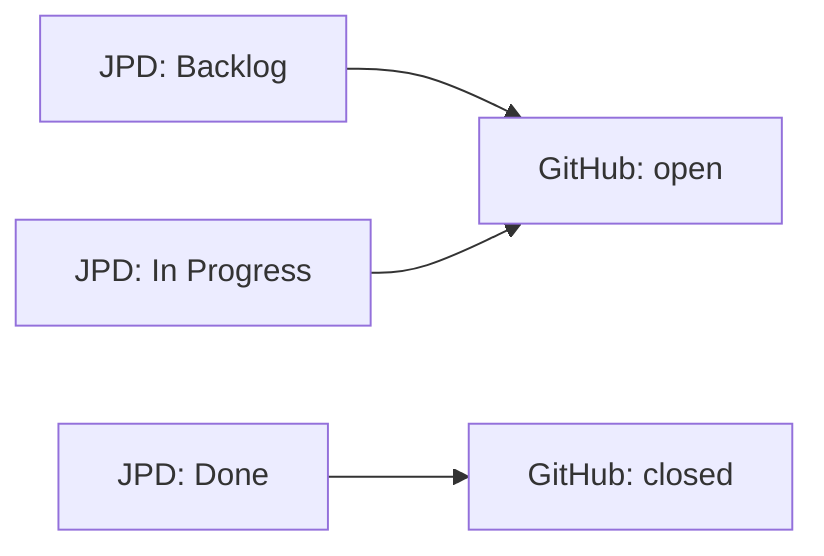

# Status Workflows

Status workflows define how issue statuses sync between JPD and GitHub. This determines when issues open, close, and how status changes flow between systems.

## Understanding Status Mapping

JPD has custom workflow statuses while GitHub has two states: `open` and `closed`. Status mapping bridges this difference:



## Basic Status Configuration

Define status mappings in the `statuses` section:

```yaml
statuses:
  "To Do":
    github_state: "open"
    
  "In Progress":
    github_state: "open"
    
  "Done":
    github_state: "closed"
```

### Status Properties

**Status Name** (key)
- The exact JPD status name
- Case-sensitive
- Must match JPD workflow exactly

**github_state** (required)
- Target GitHub state
- Values: `open` or `closed`

## One-Way Sync (JPD → GitHub)

In one-way mode, JPD status changes update GitHub:

```yaml
sync:
  direction: "jpd-to-github"

statuses:
  "Backlog":
    github_state: "open"
    
  "Ready for Delivery":
    github_state: "open"
    
  "In Progress":
    github_state: "open"
    
  "Done":
    github_state: "closed"
    
  "Cancelled":
    github_state: "closed"
```

**Behavior:**
- JPD status changes update GitHub
- GitHub state changes do **not** affect JPD
- Simple and predictable

## Bidirectional Sync (JPD ↔ GitHub)

In bidirectional mode, status changes sync both ways:

```yaml
sync:
  direction: "bidirectional"
  github_closed_status: "Done"  # Where to move JPD issues when GitHub closes

statuses:
  "Backlog":
    github_state: "open"
    
  "In Progress":
    github_state: "open"
    
  "Done":
    github_state: "closed"
```

**Behavior:**
- JPD status changes update GitHub (as before)
- Closing a GitHub issue moves JPD to `github_closed_status`
- Reopening a GitHub issue moves JPD to first `open` status

### github_closed_status

When a GitHub issue is closed, the connector moves the JPD issue to this status:

```yaml
sync:
  github_closed_status: "Done"
```

**Requirements:**
- Must be a valid status in your JPD workflow
- Should map to `github_state: "closed"`
- Case-sensitive

## Status Workflow Patterns

### Simple Workflow

Basic To Do → Done flow:

```yaml
statuses:
  "To Do":
    github_state: "open"
    
  "Done":
    github_state: "closed"
```

### Kanban Workflow

Progressive status stages:

```yaml
statuses:
  "Backlog":
    github_state: "open"
    
  "Selected for Development":
    github_state: "open"
    
  "In Progress":
    github_state: "open"
    
  "In Review":
    github_state: "open"
    
  "Done":
    github_state: "closed"
```

### Product Discovery Workflow

Status-based hierarchy (see [Hierarchy](./hierarchy)):

```yaml
statuses:
  "Parking Lot":
    github_state: "open"  # Ideas, not synced by default
    
  "Discovery":
    github_state: "open"  # Being evaluated
    
  "Impact":
    github_state: "open"  # Epics
    
  "Ready for Delivery":
    github_state: "open"  # Stories
    
  "Delivery":
    github_state: "open"  # In development
    
  "Done":
    github_state: "closed"  # Completed
```

## GitHub Projects Integration

Map statuses to GitHub Projects columns:

```yaml
projects:
  enabled: true
  project_number: 1
  status_field_name: "Status"

statuses:
  "Backlog":
    github_state: "open"
    github_project_status: "📋 Backlog"  # Exact column name
    
  "In Progress":
    github_state: "open"
    github_project_status: "🚧 In Progress"
    
  "Done":
    github_state: "closed"
    github_project_status: "✅ Done"
```

### github_project_status

**Type:** String (optional)  
**Purpose:** Column name in GitHub Projects board

**Requirements:**
- Must match column name exactly (including emojis)
- Only used when `projects.enabled: true`
- Creates/moves cards on Projects board

**Example workflow:**
1. JPD status changes to "In Progress"
2. GitHub issue state set to `open`
3. Issue card moved to "🚧 In Progress" column

## Status-Based Filtering

Control which statuses trigger sync using hierarchy configuration:

```yaml
hierarchy:
  enabled: true
  epic_statuses:
    - "Impact"
  story_statuses:
    - "Ready for Delivery"
    - "Delivery"
    - "Done"

statuses:
  "Parking Lot":
    github_state: "open"
  "Discovery":
    github_state: "open"
  "Impact":  # Epic level - syncs
    github_state: "open"
  "Ready for Delivery":  # Story level - syncs
    github_state: "open"
```

**Behavior:**
- Issues only sync when in `epic_statuses` or `story_statuses`
- "Parking Lot" and "Discovery" issues are ignored
- Provides content filtering based on readiness

See [Hierarchy Configuration](./hierarchy) for details.

## Status Validation

The connector validates status mappings:

```bash
pnpm run validate-config
```

**Checks:**
- All status names exist in JPD workflow
- `github_state` is either `open` or `closed`
- `github_closed_status` exists (if bidirectional)
- Projects column names exist (if Projects enabled)

## Common Patterns

### Progressive Disclosure

Only sync issues when they reach certain maturity:

```yaml
# Don't sync these early stages
"Idea":
  github_state: "open"  # Defined but not in epic/story statuses
"Research":
  github_state: "open"

# Start syncing at these stages
hierarchy:
  epic_statuses:
    - "Validated"  # Sync as Epic
  story_statuses:
    - "Ready for Dev"  # Sync as Story
```

### Multiple Closed States

Handle different completion reasons:

```yaml
statuses:
  "Done":
    github_state: "closed"
    
  "Won't Do":
    github_state: "closed"
    
  "Duplicate":
    github_state: "closed"

sync:
  github_closed_status: "Done"  # Default when GitHub closes
```

### Status Metadata in Labels

Add status information to labels:

```yaml
mappings:
  - jpd: "fields.status.name"
    github: "labels"
    template: "status:{{fields.status.name | slugify}}"

statuses:
  "In Progress":
    github_state: "open"
```

**Result:**
```
Labels: status:in-progress, type:story, priority:high
```

## Troubleshooting

### Status Not Found Error

**Error:** "JPD status 'In Progress' not found"

**Causes:**
- Status name doesn't match JPD exactly
- Extra spaces in status name
- Wrong case (case-sensitive)

**Solution:**
1. Check exact status name in JPD
2. Copy-paste from JPD to avoid typos
3. Ensure no trailing spaces

### Issues Not Closing in GitHub

**Causes:**
- Status doesn't map to `github_state: "closed"`
- Field mapping prevents update
- GitHub API permission issue

**Check:**
```yaml
statuses:
  "Done":
    github_state: "closed"  # Must be "closed" not "close"
```

### Bidirectional Sync Not Working

**Causes:**
- `direction` not set to `bidirectional`
- `github_closed_status` not configured
- Target status doesn't exist in JPD

**Solution:**
```yaml
sync:
  direction: "bidirectional"
  github_closed_status: "Done"  # Must match JPD status exactly
```

### Projects Column Not Updating

**Causes:**
- Projects not enabled
- Column name doesn't match exactly
- Token missing `write:discussion` scope

**Check:**
```yaml
projects:
  enabled: true  # Must be true
  project_number: 1  # Correct project number

statuses:
  "In Progress":
    github_project_status: "In Progress"  # Exact match required
```

## Testing Status Workflows

### Test One-Way Sync

1. Change JPD issue status
2. Run sync: `pnpm run dev`
3. Verify GitHub state updated

### Test Bidirectional Sync

1. Close GitHub issue
2. Run sync: `pnpm run dev`
3. Check JPD issue moved to `github_closed_status`

### Test with Dry-Run

```bash
pnpm run dev -- --dry-run
```

Output shows planned status changes:
```
Would update issue #45 (MTT-5):
  Status: In Progress → open
  Projects: → "🚧 In Progress"
```

## Complete Examples

### Minimal Configuration

```yaml
sync:
  direction: "jpd-to-github"

statuses:
  "To Do":
    github_state: "open"
  "Done":
    github_state: "closed"
```

### Full-Featured Configuration

```yaml
sync:
  direction: "bidirectional"
  github_closed_status: "Done"

projects:
  enabled: true
  project_number: 1
  status_field_name: "Status"

statuses:
  "Backlog":
    github_state: "open"
    github_project_status: "📋 Backlog"
    
  "Selected":
    github_state: "open"
    github_project_status: "🎯 Selected"
    
  "In Progress":
    github_state: "open"
    github_project_status: "🚧 In Progress"
    
  "In Review":
    github_state: "open"
    github_project_status: "👀 Review"
    
  "Done":
    github_state: "closed"
    github_project_status: "✅ Done"
    
  "Won't Do":
    github_state: "closed"
    github_project_status: "🚫 Won't Do"
```

## Next Steps

- [Configure Labels](./labels) - Define label color scheme
- [Set Up Hierarchy](./hierarchy) - Use statuses for Epic/Story levels
- [Enable Projects](./advanced) - Integrate with GitHub Projects
- [Field Mappings](./field-mappings) - Include status in issue body

:::tip Status Naming
Keep JPD status names concise and clear. They may appear in labels, templates, and logs throughout your system.
:::

