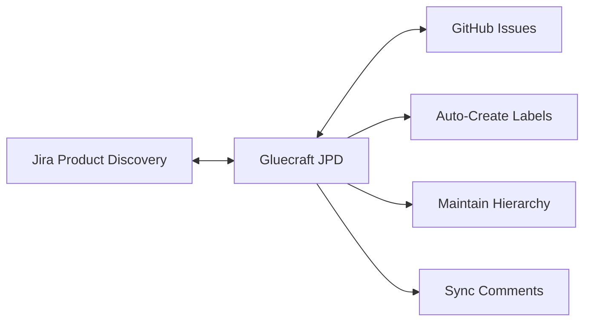

# Introduction

**Gluecraft JPD** provides bidirectional synchronization between Jira Product Discovery (JPD) and GitHub Issues, enabling seamless workflow integration between product planning and development execution.

Part of **[The Craft Lab](https://github.com/thecraftlab)** - specialized tools for modern development workflows.

## What is Gluecraft JPD?

A powerful sync engine that automatically keeps JPD and GitHub in sync, allowing product teams to plan in JPD while development teams work in GitHub, with changes flowing bidirectionally.

## Core Capabilities

- **Bidirectional Sync** - Automatic two-way synchronization between JPD and GitHub
- **Native Sub-Issues** - Real GitHub parent-child relationships for Epic > Story > Task hierarchy
- **Custom Field Mapping** - Flexible configuration for mapping JPD custom fields to GitHub labels and content
- **Comment Sync** - Team discussions synchronized across both platforms with author attribution
- **Status Workflows** - Configurable status mappings between JPD workflows and GitHub states
- **Transform Functions** - Custom TypeScript functions for complex data transformations
- **Auto-Label Creation** - Automatic GitHub label generation with configurable colors and descriptions
- **Rate Limit Handling** - Intelligent caching and exponential backoff for API rate limits

## Quick Navigation

### Getting Started
Start here if you're new to the connector:
- [Prerequisites](./getting-started/prerequisites) - System requirements and credentials
- [Quick Start](./getting-started/quick-start) - 5-minute setup with wizard
- [First Sync](./getting-started/first-sync) - Run and verify your first synchronization

### Configuration
Configure sync behavior and field mappings:
- [Configuration Overview](./configuration/overview) - Understanding the config file
- [Field Mappings](./configuration/field-mappings) - Map JPD fields to GitHub
- [Status Workflows](./configuration/status-workflows) - Configure status sync
- [Labels](./configuration/labels) - Define label strategy

### CLI Tools
Command-line tools for setup and operation:
- [CLI Overview](./cli/overview) - Available commands
- [Setup Wizard](./cli/setup-wizard) - Interactive configuration
- [Sync Commands](./cli/sync-commands) - Running synchronization
- [Validation Tools](./cli/validation) - Testing and validation

### Features
Advanced features and capabilities:
- [Sub-Issues](./features/sub-issues) - Epic/Story/Task hierarchy
- [Comment Sync](./features/comment-sync) - Bidirectional comments
- [Field Validation](./features/field-validation) - Field type validation

### Troubleshooting
Solutions for common problems:
- [Common Issues](./troubleshooting/common-issues) - Connection and config errors
- [Field Configuration](./troubleshooting/field-configuration) - Field mapping problems
- [Sync Problems](./troubleshooting/sync-problems) - Issues not syncing
- [Debugging](./troubleshooting/debugging) - Advanced debugging

## Use Cases

**Product Management**
- Plan in JPD with RICE scoring and themes
- Automatically sync refined issues to GitHub for development
- Track implementation progress in JPD

**Development Teams**
- Work in familiar GitHub Issues environment
- Status updates automatically sync back to JPD
- Comment on issues in either platform

**Cross-Functional Collaboration**
- Product and engineering stay in sync automatically
- Eliminate manual copy-paste between systems
- Single source of truth maintained across both platforms

## Architecture

The connector runs as a scheduled job (via GitHub Actions, cron, or manual execution) and maintains sync state using metadata stored in GitHub issue bodies.

## Next Steps

Choose your path:

**New Users:** Start with [Prerequisites](./getting-started/prerequisites) then run the [Quick Start](./getting-started/quick-start) wizard.

**Advanced Users:** Review [Manual Setup](./getting-started/manual-setup) for full control over configuration.

**Existing Users:** Jump to [CLI Tools](./cli/overview) or [Configuration](./configuration/overview) for reference.

## Support

- **Documentation:** Browse the guides in this documentation site
- **Issues:** Report bugs or request features on [GitHub Issues](https://github.com/thecraftlab/gluecraft/issues)
- **Contributing:** See the [Contributing Guide](./guides/contributing) for development setup

---

Ready to get started? Head to [Prerequisites](./getting-started/prerequisites) to begin your setup.
