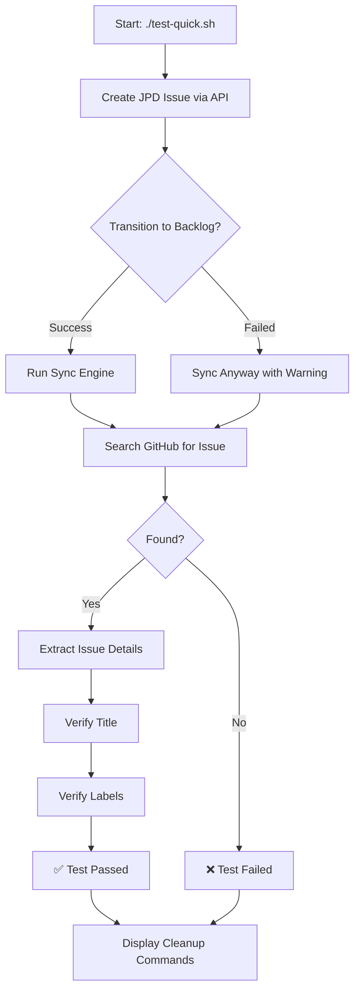
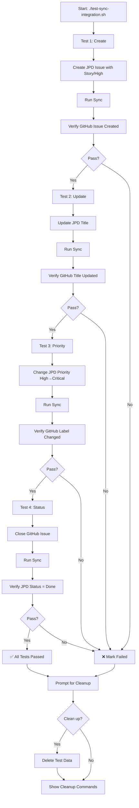
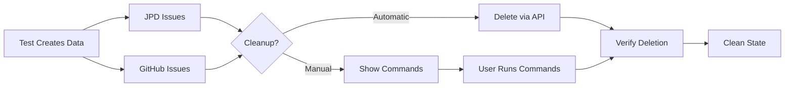
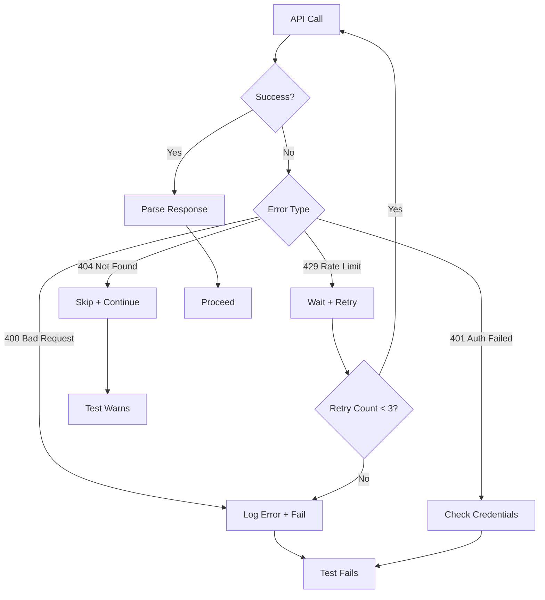

# Test Flow Visualization

## Quick Test Flow (10 seconds)



---

## Integration Test Flow (60 seconds)



---

## Data Flow: JPD → Sync Engine → GitHub

```
┌──────────────┐
│     JPD      │
│  (Source)    │
└──────┬───────┘
       │
       │ API Call: Create Issue
       │ Fields: {
       │   summary: "Test Story"
       │   customfield_14385: "Story"
       │   customfield_14425: "High"
       │ }
       ▼
┌──────────────────────┐
│   Sync Engine        │
│                      │
│  1. Fetch JPD Issues │
│  2. Filter by Status │
│  3. Transform Fields │
│  4. Generate Labels  │
│  5. Create/Update GH │
└──────┬───────────────┘
       │
       │ API Call: Create Issue
       │ Payload: {
       │   title: "Test Story"
       │   labels: ["story", "high"]
       │   body: "...[metadata]..."
       │ }
       ▼
┌──────────────┐
│   GitHub     │
│  (Target)    │
└──────────────┘
       │
       │ Test Verification
       ▼
┌──────────────────────┐
│ Verify:              │
│  ✓ Issue created     │
│  ✓ Title matches     │
│  ✓ Labels correct    │
│  ✓ Metadata present  │
└──────────────────────┘
```

---

## Data Flow: GitHub → Sync Engine → JPD

```
┌──────────────┐
│   GitHub     │
│  (Source)    │
└──────┬───────┘
       │
       │ API Call: Update Issue
       │ Change: {
       │   state: "closed"
       │ }
       ▼
┌──────────────────────┐
│   Sync Engine        │
│                      │
│  1. Fetch GH Issues  │
│  2. Compare State    │
│  3. Map Status       │
│  4. Update JPD       │
└──────┬───────────────┘
       │
       │ API Call: Transition
       │ Payload: {
       │   transition: {
       │     id: "31" (Done)
       │   }
       │ }
       ▼
┌──────────────┐
│     JPD      │
│  (Target)    │
└──────────────┘
       │
       │ Test Verification
       ▼
┌──────────────────────┐
│ Verify:              │
│  ✓ Status = Done     │
│  ✓ Transition valid  │
└──────────────────────┘
```

---

## Test Cleanup Flow



---

## Progressive Enhancement Layers

```
┌─────────────────────────────────────────────┐
│  Layer 4: Advanced Features                │  ⏳ Future
│  • Webhooks • Comments • Attachments       │
└─────────────────────────────────────────────┘
         ▲
┌─────────────────────────────────────────────┐
│  Layer 3: Hierarchy & Relationships         │  🎯 Next
│  • Parent-child links • Subtasks           │
└─────────────────────────────────────────────┘
         ▲
┌─────────────────────────────────────────────┐
│  Layer 2: Field Transforms & Labels         │  ✅ Current
│  • Priority mapping • Category labels       │
│  • Custom transforms • Status filtering    │
└─────────────────────────────────────────────┘
         ▲
┌─────────────────────────────────────────────┐
│  Layer 1: Core Sync Mechanics               │  ✅ Tested
│  • Create • Update • Status bidirectional  │
└─────────────────────────────────────────────┘
```

---

## Error Handling Flow



---

## CI/CD Integration Flow

```
┌──────────────────┐
│  Git Push        │
└────────┬─────────┘
         │
         ▼
┌──────────────────┐
│  GitHub Actions  │
│  Triggered       │
└────────┬─────────┘
         │
         ▼
┌──────────────────┐
│  Checkout Code   │
└────────┬─────────┘
         │
         ▼
┌──────────────────┐
│  Install Deps    │
│  (pnpm install)  │
└────────┬─────────┘
         │
         ▼
┌──────────────────┐
│  Setup .env      │
│  (from secrets)  │
└────────┬─────────┘
         │
         ▼
┌──────────────────────┐
│  Run Tests           │
│  ./test-integration  │
└────────┬─────────────┘
         │
         ▼
┌────────────────────┐
│  Cleanup           │
│  (always run)      │
└────────┬───────────┘
         │
    ┌────┴────┐
    ▼         ▼
┌────────┐ ┌────────┐
│  Pass  │ │  Fail  │
│  ✅    │ │  ❌    │
└────────┘ └────────┘
```

---

## State Transitions Tested

```
JPD Status Workflow:
┌──────┐    ┌───────────┐    ┌─────────┐
│ Idea │───▶│ Discovery │───▶│ Icebox  │
└──────┘    └───────────┘    └─────────┘
                                   │
                                   │ (Not synced)
                                   ▼
                              ┌──────────┐
                              │ Backlog  │◀─── Sync starts here
                              └────┬─────┘
                                   │
                                   ▼
                              ┌──────────┐
                              │  Ready   │
                              └────┬─────┘
                                   │
                                   ▼
                              ┌──────────────┐
                              │ In Progress  │
                              └────┬─────────┘
                                   │
                                   ▼
                              ┌──────────┐
                              │ In Review│
                              └────┬─────┘
                                   │
                                   ▼
                              ┌──────────┐
                              │   Done   │◀─── GH: closed
                              └──────────┘
```

---

## Label Generation Flow

```
JPD Fields          Transform         GitHub Labels
═══════════         ═════════         ══════════════

Category           Direct Map         Type Label
"Story"       ───▶ lowercase   ───▶  "story"
"Epic"        ───▶ lowercase   ───▶  "epic"
"Bug"         ───▶ lowercase   ───▶  "bug"

Priority           Custom Fn          Priority Label
"Critical"    ───▶ map to      ───▶  "critical"
"High"        ───▶ priority    ───▶  "high"
"Medium"      ───▶ levels      ───▶  "normal"
"Low"         ───▶             ───▶  "low"

Hierarchy          Metadata           Hidden Comment
parent: MTT-1 ───▶ JSON obj    ───▶  <!-- {...} -->
```

---

## Quick Reference: Test Commands

```bash
# Quick validation (10s)
./test-quick.sh

# Full suite (60s)
./test-sync-integration.sh

# With debug output
DEBUG=true ./test-quick.sh

# Cleanup only
./test-sync-integration.sh --cleanup-only

# Check syntax
bash -n test-quick.sh
bash -n test-sync-integration.sh

# View last test output
cat /tmp/quick-test-output.txt
cat /tmp/sync-output.txt
```

---

## Architecture: Test vs Production

```
┌────────────────────────────────────────────────┐
│  Production Sync (Scheduled)                   │
│                                                │
│  GitHub Actions Cron ──▶ Sync Engine          │
│         (15 min)         (all issues)          │
└────────────────────────────────────────────────┘

┌────────────────────────────────────────────────┐
│  Test Sync (On-Demand)                         │
│                                                │
│  Test Script ──▶ Create Data ──▶ Sync Engine  │
│  (manual)        (test issues)   (all issues)  │
│                       │                │       │
│                       └────────────────┴───▶   │
│                       Verify Test Results      │
└────────────────────────────────────────────────┘
```

**Key insight**: Sync engine doesn't know it's being tested. It processes all issues normally. Tests verify their specific test data was handled correctly.

